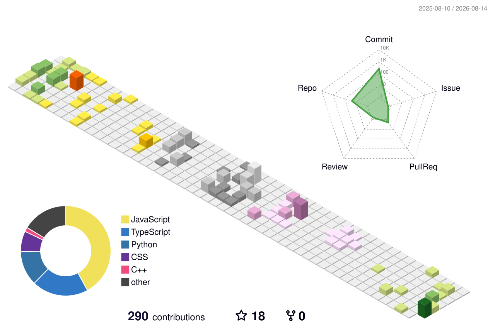

# Ganpat Singh

### Software Engineer in Progress · Full-Stack Developer · CSE Student

 

  

---

## The Story

I started with the goal of understanding how software actually works beyond writing isolated programs. That led me from programming fundamentals and problem solving into web development, APIs, databases, cloud infrastructure, and developer tooling.

Today, I learn primarily by building. Each project is an opportunity to move one layer deeper: understand the problem, design the system, write the implementation, debug what breaks, and eventually deploy it.

My current direction is **software engineering with a strong full-stack and backend foundation**. I am particularly interested in the point where application development meets infrastructure: APIs, databases, authentication, deployment, automation, and reliable systems.

> **Learn → Build → Debug → Ship → Improve**

---

## What I Build

My projects are less about collecting technologies and more about solving different engineering problems.

| Project | Engineering Problem | Technologies |
|---|---|---|
| **UniShare** | Building a community platform around real student workflows | Next.js · React · TypeScript · Supabase |
| **BASTI** | Interacting with and monitoring a desktop operating system | Tauri · Rust · React · TypeScript |
| **PII Redaction Service** | Detecting and safely redacting sensitive information from documents | Python · FastAPI · Render |
| **Earthquake Analysis Dashboard** | Turning live seismic data into useful analytical views | Power BI · DAX · Power Query · USGS API |
| **Earthquake Risk Predictor** | Applying machine learning to classify earthquake risk | Python · Scikit-learn · FastAPI · React |
| **GROOT** | Understanding how Git-like object storage and repositories work | Python · CLI |

The common thread is simple: **take a real problem, understand the underlying system, and build something that works.**

---

## Engineering Stack

### Languages
C++ · JavaScript · TypeScript · Python · Rust · SQL

### Application Development
React · Next.js · Tailwind CSS · Node.js · Express · FastAPI

### Data & Backend
PostgreSQL · Supabase · REST APIs · Authentication · Data Processing

### Infrastructure & DevOps
Git · GitHub Actions · Docker · Jenkins · AWS · Linux · Render · Vercel

---

## How I Learn

I prefer learning by going through the entire engineering loop rather than studying technologies in isolation.

**Understand the concept** → **build a small implementation** → **break it** → **debug it** → **apply it in a project** → **document what I learned**.

This approach is why my interests have expanded from frontend development into backend architecture, DevOps, cloud, system design, and developer tooling.

---

## Current Focus

My current engineering priorities are:

- Strengthening **DSA and problem-solving** with C++.
- Building stronger **backend fundamentals** around APIs, databases, authentication, and application architecture.
- Improving **DevOps and cloud skills** through Docker, AWS, CI/CD, and Linux.
- Understanding **system design and production-oriented engineering**, not just application-level code.
- Continuing to build projects that force me to learn unfamiliar parts of the stack.

---

## GitHub Activity

 

---

## Contribution Profile

The contribution graph is one of the better representations of how I work: small iterations, experiments, fixes, and projects accumulating over time.

---

## 3D Contribution Profile

---

## Beyond the Code

I am interested in the engineering decisions behind software: why a particular architecture is chosen, where a system fails under real conditions, how services communicate, how deployments are automated, and how a project evolves from a prototype into something maintainable.

That is the direction I am working toward — becoming someone who can take a problem from **idea → architecture → implementation → deployment → maintenance**.

---

## Connect

 

Building in public, one system at a time.

